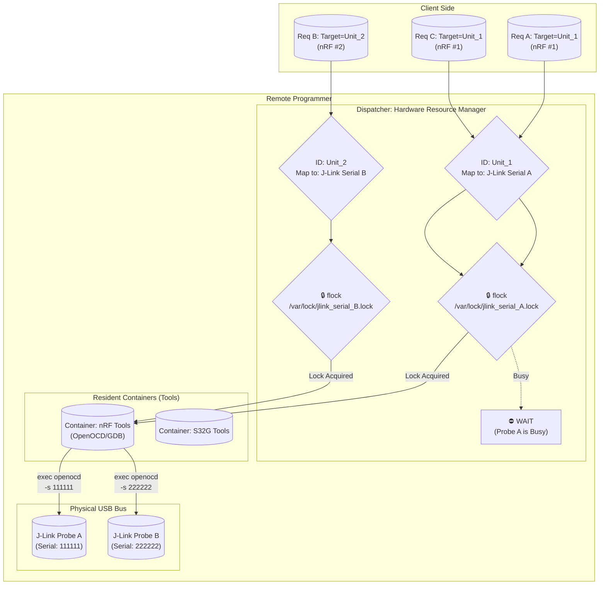

# Debug Probe Hub

A unified remote debugging and firmware flashing hub for managing multiple microcontroller projects and debug probes.

## Problem Statement

### The Challenge

Modern embedded development often involves:
- **Multiple projects**: Switching between different firmware repositories (nRF52, ESP32, STM32, CH32V, etc.)
- **Multiple boards**: Several prototype boards under simultaneous development
- **Complex toolchains**: Different debug probe types (J-Link, CMSIS-DAP, WCH-Link) and programming tools
- **Remote development**: Dev containers on powerful remote servers, separate from physical hardware
- **High task-switching overhead**: Managing the matrix of (MCU × Board × Probe × Tool) becomes unmanageable

### Why This Solution?

Initial approaches tried:
1. ❌ **USB/IP forwarding**: Failed - WCH-Link doesn't work reliably over USB/IP
2. ✅ **Remote GDB server architecture**: Proven, reliable approach
   - Debug probes physically connected to a dedicated hub server
   - GDB servers (OpenOCD, JLinkGDBServer) run remotely
   - Dev containers connect to remote GDB servers
   - Centralized probe and target management

### What This Solves

- **Centralized configuration**: All probe/target combinations in one YAML file
- **Concurrent access control**: File-based locking prevents probe conflicts
- **Probe identification**: Serial number-based routing to specific hardware
- **Isolated toolchains**: Docker containers for each MCU family (ARM, ESP32, WCH RISC-V)
- **REST API**: Simple HTTP interface for remote firmware flashing and debug sessions

## Target Environment

This system is designed for:
- **Development machine**: Windows PC running VSCode with Dev Containers (or any remote development environment)
- **Build server**: Powerful remote Linux server hosting Dev Containers
- **Debug probe hub**: Dedicated Linux server (Raspberry Pi, Intel NUC, or Proxmox VM) physically near target boards
- **Network**: All machines on same local network

```
┌─────────────────┐         ┌──────────────────┐         ┌─────────────────────┐
│  Windows PC     │         │  Build Server    │         │  Debug Probe Hub    │
│  + VSCode       │────────▶│  + Dev Container │◀───────▶│  + Physical Probes  │
│                 │  Remote │  + Build Tools   │   HTTP  │  + Docker Tools     │
│                 │   SSH   │                  │   API   │  + GDB Servers      │
└─────────────────┘         └──────────────────┘         └─────────────────────┘
                                                                    │
                                                          ┌─────────┴─────────┐
                                                          │  Target Boards    │
                                                          │  (nRF, ESP, etc.) │
                                                          └───────────────────┘
```

## Overview

Debug Probe Hub provides a centralized HTTP API to manage firmware flashing and debugging sessions across multiple debug probes and target devices. All configuration is centralized in `config.yml`, making it easy to add new probes or targets.

## Features

- ✅ **Remote GDB Server Management**: Start/stop debug sessions remotely, connect from any dev container
- ✅ **Concurrent Access Control**: File-based locking (`flock`) prevents probe conflicts
- ✅ **Multi-Probe Support**: J-Link, CMSIS-DAP, WCH-Link - add more without code changes
- ✅ **Multi-Target Support**: nRF52840, ESP32-S3, STM32G3, CH32V series - easily extensible
- ✅ **Interface-Based Routing**: Probes matched by type (`jlink`, `cmsis-dap`), not hardcoded IDs
- ✅ **Serial Number Identification**: Route requests to specific probe when multiple of same type exist
- ✅ **Isolated Toolchains**: Docker containers per MCU family (ARM, ESP32, WCH RISC-V)
- ✅ **REST API**: Simple HTTP interface for firmware flashing and debug control
- ✅ **Auto-generated udev Rules**: Consistent `/dev/probes/probe_N` naming
- ✅ **Systemd Integration**: Automatic startup with dependency management
- ✅ **Configuration-Driven**: All settings in `config.yml` - no code changes needed

## Architecture

### High-Level Component Overview

```
┌─────────────────────────────────────────────────────────────┐
│                     HTTP Server (port 8080)                 │
│                        server.py                            │
├─────────────────────────────────────────────────────────────┤
│  Endpoints:                                                 │
│  • GET  /status          - Check probe connections          │
│  • GET  /probes/search   - Find probe by interface/VID/PID  │
│  • GET  /targets         - List supported MCU targets       │
│  • POST /dispatch        - Flash firmware or start debug    │
└────────┬────────────────────────────────────────────────────┘
         │
         ├─→ config_loader.py (YAML configuration parser)
         ├─→ probe_status.py  (USB device detection)
         │
         └─→ debug_dispatcher.py (Command execution + locking)
                    │
                    ├─→ Docker: debug-box-std (OpenOCD, J-Link)
                    ├─→ Docker: debug-box-esp (OpenOCD-ESP32)
                    └─→ Docker: debug-box-wch (WCH OpenOCD, wlink)
```

### Detailed Request Flow with Concurrency Control

This diagram shows how multiple concurrent requests are handled with probe-level locking:



### Key Architecture Features

1. **Probe-Level Locking (`flock`)**
   - Each probe gets exclusive file lock: `/var/lock/probe_{id}.lock`
   - Multiple clients can access different probes simultaneously
   - Same probe requests are serialized automatically
   - Non-blocking lock attempt - immediate feedback if busy

2. **Container-Based Tool Isolation**
   - **debug-box-std**: OpenOCD, J-Link tools (ARM Cortex-M)
   - **debug-box-esp**: ESP-IDF toolchain, OpenOCD-ESP32
   - **debug-box-wch**: minichlink (WCH CH32V RISC-V)
   - Containers share host USB and network (privileged mode)

3. **Interface-Based Probe Matching**
   - Probes identified by `interface` type (`jlink`, `cmsis-dap`, `wch-link`)
   - Targets specify compatible interfaces, not probe IDs
   - Adding new probes doesn't require target configuration changes
   - Serial number-based routing for multiple probes of same type

4. **Configuration-Driven Design**
   - Single YAML file for all probes, targets, and containers
   - Easy to add new MCU targets or debug probes
   - Command templates support placeholders: `{serial}`, `{gdb_port}`, `{firmware_path}`

## File Structure

```
debug-probe-hub/
├── config.yml                  # Main configuration file
├── config_loader.py            # Configuration parser library
├── server.py                   # HTTP API server
├── debug_dispatcher.py         # Command execution logic
├── probe_status.py             # Probe status checker
├── probe_finder.py             # Probe search utility
├── generate_udev_rules.py      # udev rules generator
├── setup.sh                    # Setup script
├── pyproject.toml              # Python project metadata
├── LICENSE                     # MIT License
├── docker-compose.yml          # Container orchestration
└── docker/
    ├── standard/Dockerfile     # Standard ARM tools
    ├── esp32/Dockerfile        # ESP32 tools
    └── wch/Dockerfile          # WCH RISC-V tools
```

## Quick Start

**TL;DR** for experienced users:

```bash
# 1. Clone repository
git clone https://github.com/yourusername/debug-probe-hub.git /opt/debug-probe-hub
cd /opt/debug-probe-hub

# 2. Edit config.yml (update probe serial numbers)
nano config.yml

# 3. Run automated setup
./setup.sh

# 4. Start service
sudo systemctl enable --now debug-probe-hub.service

# 5. Test
curl http://localhost:8080/status
```

For **Proxmox/VM deployment** with cloud-init automation, see [deploy/README.md](deploy/README.md).

## Setup

### Deployment Options

#### Option 1: Proxmox VM with Cloud-init (Recommended)

For automated deployment on Proxmox with static IP configuration:

**See [deploy/README.md](deploy/README.md) for complete Proxmox deployment guide**

Quick summary:
1. Prepare Ubuntu 24.04 LTS cloud image (or 22.04 LTS)
2. Configure `deploy/cloud-init-user-data.yml` (add SSH key)
3. Configure `deploy/cloud-init-network.yml` (set static IP: 192.168.1.234)
4. Create VM in Proxmox with cloud-init
5. Configure USB passthrough for debug probes
6. Start VM - everything installs automatically!

#### Option 2: Manual Installation

### Prerequisites

- Linux host (tested on Ubuntu 24.04 LTS and 22.04 LTS)
- Docker and Docker Compose
- Python 3.8+
- Root access (for udev rules)

### Installation

1. Clone or extract this repository

2. Review and customize `config.yml`:
   - Update probe serial numbers
   - Adjust vendor/product IDs if needed
   - Add or remove targets as needed

3. Run setup script:
```bash
./setup.sh
```

This will:
- Install Python dependencies
- Generate and install udev rules
- Build Docker images
- Create working directories

### ⚠️ WCH Toolchain Configuration (REQUIRED for WCH-Link support)

**IMPORTANT:** The WCH container requires private repository access due to license restrictions.

#### Background

WCH OpenOCD binaries **cannot be publicly redistributed** because:
- WCH does not provide source code for their OpenOCD fork
- Redistributing binaries without source code violates GPL license requirements
- Creating a public mirror would expose you to copyright/license violation claims

#### Setup Instructions

**Step 1: Obtain WCH Toolchain Access**

You need a private `wch-toolchain-mirror` repository. This repository should contain:
- A `.tar.gz` or `.tar.xz` archive with WCH OpenOCD and GCC toolchain binaries
- Git LFS enabled for large binary files
- Archive structure matching WCH MounRiverStudio layout (OpenOCD/, Toolchain/, etc.)

**IMPORTANT:** Keep this repository **private** - do not redistribute publicly due to license restrictions.

Options to obtain:
1. Create your own private `wch-toolchain-mirror` repository from WCH MounRiverStudio installation
2. Use your organization's private toolchain repository
3. Contact WCH for official toolchain access

**Step 2: Configure Build Access**

The easiest method is using `docker-compose.override.yml`:

```bash
# 1. Copy the template
cp docker-compose.override.yml.template docker-compose.override.yml

# 2. Edit docker-compose.override.yml
nano docker-compose.override.yml

# Set your private repository URL with access token:
# services:
#   debug-box-wch:
#     build:
#       args:
#         WCH_TOOLCHAIN_URL: "https://YOUR_TOKEN@github.com/YOUR_ORG/wch-toolchain-mirror.git"

# 3. Build the WCH container
docker-compose build debug-box-wch
```

**Alternative Methods:**

Environment variable:
```bash
export WCH_TOOLCHAIN_URL="https://YOUR_TOKEN@github.com/YOUR_ORG/wch-toolchain-mirror.git"
docker-compose build debug-box-wch
```

BuildKit secrets (CI/CD):
```bash
echo "YOUR_TOKEN" > .git-token
export DOCKER_BUILDKIT=1
docker build \
  --secret id=git_token,src=.git-token \
  --build-arg WCH_TOOLCHAIN_URL="https://github.com/YOUR_ORG/wch-toolchain-mirror.git" \
  -f docker/wch/Dockerfile \
  -t debug-probe-hub-wch:latest \
  docker/wch
```

**Security Notes:**
- Never commit tokens or credentials to the repository
- `docker-compose.override.yml` is gitignored automatically
- Use BuildKit secrets for production/CI environments
- Rotate tokens regularly

---

4. Connect your debug probes and verify:
```bash
ls -l /dev/probes/
```

You should see symlinks like `probe_1`, `probe_2`, etc.

### Manual Setup

If you prefer manual setup:

```bash
# Install dependencies
pip3 install pyyaml

# Generate udev rules
python3 generate_udev_rules.py
sudo cp 99-debug-probe-hub.rules /etc/udev/rules.d/
sudo udevadm control --reload-rules
sudo udevadm trigger

# Build containers
docker-compose build

# Start containers
docker-compose up -d

# Start server
python3 server.py
```

## Usage

### Start the System

#### Using systemd (Recommended)

The system includes three systemd services that run in sequence:

```bash
# Enable and start all services (dependencies handled automatically)
sudo systemctl enable debug-probe-hub.service
sudo systemctl start debug-probe-hub.service

# Check status
systemctl status debug-probe-hub-pre-setup.service  # Step 1: udev rules, dependencies
systemctl status debug-probe-hub-setup.service      # Step 2: Docker image builds
systemctl status debug-probe-hub.service            # Step 3: Main server

# View logs
journalctl -u debug-probe-hub -f
```

The services run in this order:
1. **debug-probe-hub-pre-setup.service**: Installs Python dependencies, generates and installs udev rules
2. **debug-probe-hub-setup.service**: Builds Docker images (runs once or when images need updating)
3. **debug-probe-hub.service**: Starts Docker containers and runs the HTTP server

#### Manual Start

```bash
# Start Docker containers
docker-compose up -d

# Start HTTP server (in another terminal)
python3 server.py
```

### API Endpoints

#### GET /status
Check status of all probes

```bash
curl http://localhost:8080/status
```

Response:
```json
[
  {
    "id": 1,
    "name": "Segger J-Link",
    "status": "connected",
    "serial": "000051025665",
    "expected_serial": "000051025665",
    "match": true
  },
  ...
]
```

#### GET /probes
List all configured probes

```bash
curl http://localhost:8080/probes
```

#### GET /probes/search
Search for probes by interface, VID/PID, serial, or name

This endpoint allows clients to find probes without knowing internal probe IDs. Clients only need to know physical identifiers like interface type, VID/PID, or serial numbers.

**Query Parameters:**
- `interface` - Interface type (e.g., "jlink", "cmsis-dap", "wch-link")
- `vid` or `vendor_id` - USB Vendor ID (e.g., "1366" or "0x1366")
- `pid` or `product_id` - USB Product ID (e.g., "0105")
- `serial` - Serial number (for disambiguation when multiple probes of same type)
- `name` - Partial name match (e.g., "J-Link")

**Examples:**

Find all J-Link probes:
```bash
curl "http://localhost:8080/probes/search?interface=jlink"
```

Find probe by VID/PID:
```bash
curl "http://localhost:8080/probes/search?vid=1366&pid=0105"
```

Find specific probe by serial (when you have multiple of same type):
```bash
curl "http://localhost:8080/probes/search?interface=jlink&serial=000051025665"
```

Find by name:
```bash
curl "http://localhost:8080/probes/search?name=WCH-Link"
```

**Response:**
```json
{
  "query": {
    "interface": "jlink",
    "vendor_id": null,
    "product_id": null,
    "serial": null,
    "name": null
  },
  "matches": [
    {
      "id": 1,
      "name": "Segger J-Link",
      "serial": "000051025665",
      "vendor_id": "1366",
      "product_id": "0105",
      "interface": "jlink"
    }
  ],
  "count": 1
}
```

**Using probe search in dispatch:**

Instead of hardcoding probe IDs, clients can search first:
```bash
# 1. Find the probe
PROBE_ID=$(curl -s "http://localhost:8080/probes/search?interface=jlink" | jq -r '.matches[0].id')

# 2. Use it for flashing
curl -X POST http://localhost:8080/dispatch \
  -F "target=nrf52840" \
  -F "probe=$PROBE_ID" \
  -F "mode=flash" \
  -F "file=@firmware.hex"
```

#### GET /targets
List all supported targets

```bash
curl http://localhost:8080/targets
```

#### POST /dispatch
Flash firmware or start debug session

Flash firmware:
```bash
curl -X POST http://localhost:8080/dispatch \
  -F "target=nrf52840" \
  -F "probe=1" \
  -F "mode=flash" \
  -F "file=@firmware.hex"
```

Start debug session:
```bash
curl -X POST http://localhost:8080/dispatch \
  -F "target=nrf52840" \
  -F "probe=1" \
  -F "mode=debug"
```

Then connect GDB:
```bash
arm-none-eabi-gdb -ex "target remote localhost:3331"
```

## Common Usage Patterns

### Example 1: Flash firmware without knowing probe ID

```bash
# Find any available J-Link probe
PROBE_ID=$(curl -s "http://localhost:8080/probes/search?interface=jlink" | jq -r '.matches[0].id')

# Flash firmware
curl -X POST http://localhost:8080/dispatch \
  -F "target=nrf52840" \
  -F "probe=$PROBE_ID" \
  -F "mode=flash" \
  -F "file=@firmware.hex"
```

### Example 2: Use specific probe when multiple are connected

```bash
# You have 2 CMSIS-DAP probes, use the one with specific serial
PROBE_ID=$(curl -s "http://localhost:8080/probes/search?interface=cmsis-dap&serial=C2428F064718" | jq -r '.matches[0].id')

curl -X POST http://localhost:8080/dispatch \
  -F "target=stm32g3" \
  -F "probe=$PROBE_ID" \
  -F "mode=debug"
```

### Example 3: Command-line probe search tool

```bash
# Search by interface
python3 probe_finder.py --interface jlink

# Search by VID/PID
python3 probe_finder.py --vendor-id 1366 --product-id 0105

# Search by name
python3 probe_finder.py --name "WCH-Link"

# Combined search with JSON output
python3 probe_finder.py --interface cmsis-dap --serial C2428F064718 --json
```

## Configuration

### Adding a New Probe

#### Step 1: Find USB Device Information

Connect your probe and identify it:

```bash
# List USB devices
lsusb

# Example output:
# Bus 001 Device 010: ID 0d28:0204 NXP ARM mbed

# Get serial number
udevadm info -q property /dev/bus/usb/001/010 | grep SERIAL
# Example output:
# ID_SERIAL_SHORT=0240000034544e45001e0016e2f3000a4eb1000097969900
```

#### Step 2: Add Probe to config.yml

Edit `config.yml` and add to the `probes` section:

```yaml
probes:
  - id: 5
    name: "NXP LPC-Link2"
    serial: "0240000034544e45001e0016e2f3000a4eb1000097969900"
    vendor_id: "0d28"
    product_id: "0204"
    interface: cmsis-dap  # Use existing interface type
```

**Interface Type Selection:**
- `jlink` - Segger J-Link probes
- `cmsis-dap` - ARM CMSIS-DAP compatible (OpenOCD, pyOCD)
- `wch-link` - WCH-Link for CH32V RISC-V
- Custom interface - See "Adding a New Interface Type" section

#### Step 3: Regenerate udev Rules

```bash
python3 generate_udev_rules.py
sudo cp 99-debug-probe-hub.rules /etc/udev/rules.d/
sudo udevadm control --reload-rules
sudo udevadm trigger
```

#### Step 4: Verify Detection

```bash
# Check udev symlink created
ls -l /dev/probes/

# Test via API
curl http://localhost:8080/status
curl "http://localhost:8080/probes/search?interface=cmsis-dap"
```

#### Notes on Probe IDs

- **ID assignment**: Use sequential integers (1, 2, 3, ...)
- **ID purpose**: Used only for locking (`/var/lock/probe_{id}.lock`) and udev naming
- **Not used for routing**: Targets match probes by `interface` type, not ID
- **Multiple same-type probes**: Differentiated by serial number in commands

### Adding a New Target

Edit `config.yml` and add to the `targets` section:

```yaml
targets:
  my_mcu:
    container: standard
    description: "My Custom MCU"
    compatible_probes: [jlink, cmsis-dap]
    commands:
      jlink:
        debug: "JLinkGDBServer -device MyMCU -if SWD -port {gdb_port}"
        flash: "JLinkExe -CommandFile /tmp/flash.jlink"
      cmsis-dap:
        debug: "openocd -f interface/cmsis-dap.cfg -f target/mymcu.cfg ..."
        flash: "openocd ... -c 'program {firmware_path} verify reset exit'"
```

### Adding a New Interface Type and Tool

**Example: Adding Arduino Support (USB-Serial + Arduino CLI)**

This example shows adding both a new **interface type** (hardware category) and a new **container/tool** (software).

**Key Concept:**
- **Interface** = Hardware interface (e.g., `usb-serial`, `cmsis-dap`, `wch-link`)
- **Container/Tool** = Programming software (e.g., `arduino-cli`, `OpenOCD`, `minichlink`)

For Arduino boards:
- Interface: `usb-serial` (built-in USB-UART on most Arduino boards)
- Tool: `arduino-cli` (programming software)

#### 1. Create New Docker Container (Tool)

Create `docker/arduino/Dockerfile`:

```dockerfile
FROM ubuntu:22.04

# Install Arduino CLI
RUN apt-get update && apt-get install -y \
    curl \
    udev \
    && curl -fsSL https://raw.githubusercontent.com/arduino/arduino-cli/master/install.sh | sh \
    && mv bin/arduino-cli /usr/local/bin/ \
    && rm -rf /var/lib/apt/lists/*

# Install cores (example: AVR for Uno, ESP32)
RUN arduino-cli core update-index && \
    arduino-cli core install arduino:avr && \
    arduino-cli core install esp32:esp32

WORKDIR /work
CMD ["sleep", "infinity"]
```

#### 2. Add Container to docker-compose.yml

```yaml
services:
  debug-box-arduino:
    build:
      context: ./docker/arduino
    image: debug-probe-hub-arduino:latest
    container_name: debug-box-arduino
    privileged: true
    volumes:
      - /dev:/dev
      - /tmp/flash_staging:/work
    command: sleep infinity
    network_mode: host
    restart: unless-stopped
```

#### 3. Add Container Definition to config.yml

```yaml
containers:
  arduino:
    name: debug-box-arduino
    image_name: debug-probe-hub-arduino
    build_context: ./docker/arduino
    description: "Arduino CLI tools (AVR, ESP32)"
```

#### 4. Add Probe with Interface Type (Hardware Category)

```yaml
probes:
  - id: 5
    name: "Arduino Uno USB-Serial"
    serial: "55740343038351F090A0"
    vendor_id: "2341"    # Arduino vendor ID
    product_id: "0043"   # Uno R3
    interface: usb-serial  # Interface = hardware type, NOT tool name!
```

**Note:** Multiple boards can share the same `interface: usb-serial` (Arduino Uno, Nano, Mega, ESP32 dev boards, etc.)

#### 5. Add Target Using New Interface

```yaml
targets:
  atmega328p:
    container: arduino           # Which container/tool to use
    description: "ATmega328P (Arduino Uno)"
    compatible_probes: [usb-serial]  # Compatible with USB-serial interface
    commands:
      usb-serial:                # Command for this interface type
        flash: "arduino-cli upload -p /dev/ttyACM0 --fqbn arduino:avr:uno {firmware_path}"

  esp32_arduino:
    container: arduino
    description: "ESP32 (Arduino framework)"
    compatible_probes: [usb-serial]
    commands:
      usb-serial:
        flash: "arduino-cli upload -p /dev/ttyUSB0 --fqbn esp32:esp32:esp32 {firmware_path}"
```

#### 6. (Optional) Add Cleanup Logic

**Important:** Cleanup is only needed for **persistent processes** (GDB servers, etc.), not for one-shot tools.

- ✅ **Need cleanup:** `JLinkGDBServer`, `openocd` (run in background, listen on ports)
- ❌ **No cleanup needed:** `arduino-cli upload`, `picotool load` (run and exit immediately)

If your tool is a persistent process, edit `debug_dispatcher.py` cleanup_previous_session():

```python
elif interface == "usb-serial":
    # Arduino CLI doesn't need cleanup - it's a one-shot command
    pass
```

For persistent tools:
```python
elif interface == "new-persistent-interface":
    subprocess.run(
        ["docker", "exec", container_name, "pkill", "your-gdb-server"],
        stderr=subprocess.DEVNULL
    )
```

#### 7. Build and Test

```bash
# Rebuild containers
docker-compose build

# Test new interface
curl -X POST http://localhost:8080/dispatch \
  -F "target=atmega328p" \
  -F "probe=5" \
  -F "mode=flash" \
  -F "file=@sketch.hex"
```

### Extensibility Summary

| Component | What It Represents | Extensibility | How to Add |
|-----------|-------------------|--------------|------------|
| **Interface Type** | Hardware category<br>(e.g., `cmsis-dap`, `usb-serial`, `wch-link`) | ✅ Fully extensible | Add to `probes[].interface` in config.yml |
| **Container/Tool** | Programming software<br>(e.g., OpenOCD, arduino-cli, minichlink) | ✅ Fully extensible | Add Dockerfile + docker-compose entry + config.yml |
| **Targets** | MCU/Board definitions | ✅ Fully extensible | Add to `targets` section in config.yml |
| **Commands** | Tool invocation commands | ✅ Fully extensible | Add to `targets[].commands[interface]` in config.yml |
| **Cleanup Logic** | Process termination | ⚠️ Code change needed | Edit `debug_dispatcher.py` (only for GDB servers) |

**Key Distinction:**
- **Interface** = What the hardware IS (USB-Serial, CMSIS-DAP, J-Link protocol)
- **Tool** = What software you USE to program it (arduino-cli, OpenOCD, JLinkExe)

**Example:**
- Many boards have `usb-serial` interface (Arduino Uno, ESP32 DevKit, CH340 adapter)
- You choose the tool: `arduino-cli`, `esptool.py`, or direct serial bootloader
- Same interface, different tools → different containers

**Key Point**: The system is configuration-driven. Most extensions require **zero code changes** - just Docker containers and YAML configuration!

### Real-World Extension Examples

**Example 1: Adding Raspberry Pi Pico**

Raspberry Pi Pico supports two methods:
- **CMSIS-DAP** (via Raspberry Pi Debug Probe hardware) → Use existing OpenOCD container
- **USB-Serial bootloader** (built-in) → Add picotool container

```yaml
# New container with picotool for USB bootloader mode
containers:
  pico:
    name: debug-box-pico
    image_name: debug-probe-hub-pico
    build_context: ./docker/pico
    description: "Raspberry Pi Pico tools (picotool, OpenOCD)"

# Hardware probe using CMSIS-DAP
probes:
  - id: 6
    name: "Raspberry Pi Debug Probe"
    serial: "E6614103E73A2D28"
    vendor_id: "2e8a"
    product_id: "000c"
    interface: cmsis-dap  # Uses CMSIS-DAP protocol!

# Pico in BOOTSEL mode (appears as USB Mass Storage)
  - id: 7
    name: "RP2040 BOOTSEL Mode"
    serial: "E66118602B34D129"
    vendor_id: "2e8a"
    product_id: "0003"
    interface: rp2040-bootsel  # New interface for bootloader mode

# Target can use either method
targets:
  rp2040:
    container: pico
    description: "Raspberry Pi RP2040"
    compatible_probes: [cmsis-dap, rp2040-bootsel]
    commands:
      cmsis-dap:
        debug: "openocd -f interface/cmsis-dap.cfg -f target/rp2040.cfg -c 'adapter serial {serial}' -c 'gdb_port {gdb_port}'"
        flash: "openocd -f interface/cmsis-dap.cfg -f target/rp2040.cfg -c 'adapter serial {serial}' -c 'program {firmware_path} verify reset exit'"
      rp2040-bootsel:
        flash: "picotool load {firmware_path} -f"
```

**Example 2: Adding STM32CubeProgrammer**

```yaml
# Add as new interface to existing standard container
probes:
  - id: 7
    name: "ST-Link V3"
    serial: "003C00203437510D34313939"
    vendor_id: "0483"
    product_id: "374e"
    interface: stlink-v3

targets:
  stm32h7:
    container: standard  # Can reuse existing container if tools installed
    description: "STM32H7 series"
    compatible_probes: [stlink-v3, cmsis-dap]
    commands:
      stlink-v3:
        flash: "STM32_Programmer_CLI -c port=SWD sn={serial} -w {firmware_path} -v -rst"
```

**Example 3: Adding ESP32 with esptool (USB-Serial)**

ESP32 dev boards use built-in USB-serial for flashing:

```yaml
# Add to existing ESP32 container (already has esptool.py)
probes:
  - id: 8
    name: "ESP32-DevKitC USB-Serial"
    serial: "0001"
    vendor_id: "10c4"
    product_id: "ea60"
    interface: usb-serial  # Same as Arduino! Different tool.

targets:
  esp32_native:
    container: esp32  # ESP32 container has esptool.py
    description: "ESP32 (native ESP-IDF)"
    compatible_probes: [usb-serial, cmsis-dap]  # Can use both!
    commands:
      usb-serial:
        flash: "esptool.py -p /dev/ttyUSB0 -b 460800 write_flash 0x0 {firmware_path}"
      cmsis-dap:
        debug: "openocd -f interface/cmsis-dap.cfg -f board/esp32s3-builtin.cfg ..."
```

**Key Insight:** Same `usb-serial` interface, different tools:
- Arduino boards → `arduino-cli` (in arduino container)
- ESP32 boards → `esptool.py` (in esp32 container)
- CH340 adapter → Could use either, depending on target!

**For Completely Custom Hardware:**

You only need:
1. Identify the hardware interface type (or create new one)
2. Docker container with your tools
3. Probe definition with interface type
4. Target commands using your tools

No Python code changes required - the dispatcher handles any interface type defined in config.yml!

### Command Templates

Command templates support the following placeholders:
- `{serial}` - Probe serial number
- `{gdb_port}` - GDB server port (base + probe_id)
- `{telnet_port}` - Telnet port (base + probe_id)
- `{firmware_path}` - Path to firmware file in container

## Troubleshooting

### Probes not detected

Check udev rules:
```bash
ls -l /dev/probes/
sudo udevadm info /dev/probes/probe_1
```

### Docker container issues

Check container logs:
```bash
docker-compose logs debug-box-std
```

Verify container is running:
```bash
docker ps
```

### Permission issues

Ensure your user is in the dialout group:
```bash
sudo usermod -a -G dialout $USER
```

Log out and back in for changes to take effect.

### Port conflicts

If GDB ports conflict, adjust `ports.gdb_base` in `config.yml`.

## Development

### Running Tests

```bash
# Test probe status
python3 probe_status.py

# Test configuration loading
python3 -c "from config_loader import get_config; print(get_config().get_all_probes())"

# Test dispatcher (requires running containers)
python3 debug_dispatcher.py nrf52840 1 debug
```

### Adding New Features

The modular design makes it easy to extend:

1. **config_loader.py**: Add helper methods for new config sections
2. **server.py**: Add new API endpoints
3. **debug_dispatcher.py**: Add new execution modes
4. **config.yml**: Add new targets, probes, or containers

## Installation

### Using pip (Recommended)

```bash
# Clone the repository
git clone https://github.com/yourusername/debug-probe-hub.git
cd debug-probe-hub

# Install with dependencies
pip install -e .

# Or install from PyPI (when published)
pip install debug-probe-hub
```

### Manual Installation

Follow the setup instructions in the "Setup" section above.

## License

This project is licensed under the MIT License - see the [LICENSE](LICENSE) file for details.

## Acknowledgments

- [OpenOCD](https://openocd.org/) - Open On-Chip Debugger
- [Espressif ESP-IDF](https://github.com/espressif/esp-idf) - ESP32 development framework
- [Segger J-Link](https://www.segger.com/products/debug-probes/j-link/) - Professional debug probes
- [wlink](https://github.com/ch32-rs/wlink) - Rust-based WCH-Link CLI tool for SWDIO debug printing
- [WCH](http://www.wch-ic.com/) - WCH RISC-V microcontrollers and debug tools

## Contributing

Contributions are welcome! Please feel free to submit a Pull Request.

## Support

For issues or questions, please check:
1. This README
2. Generated udev rules: `99-debug-probe-hub.rules`
3. Container logs: `docker-compose logs`
4. Server logs: Check stderr output from `server.py`
5. [GitHub Issues](https://github.com/yourusername/debug-probe-hub/issues)
