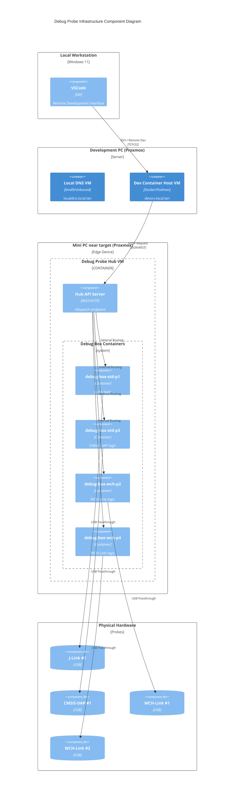

# Debug Probe Hub

Unified remote debugging and firmware flashing hub for multiple MCU targets and probe types.

## Start Here

- Proxmox production deployment: `docs/deploy.md`
- Architecture and diagrams: `docs/architecture.md`
- API reference and request examples: `docs/api.md`
- Configuration guide (`config.yml`): `docs/configuration.md`
- Operations (manual setup, runbook, troubleshooting): `docs/operations.md`

## System Topology



## USB and Container Model

- One image per toolchain, one container per `probe_id` (example: `debug-box-std-p1`).
- Probe routing is done by `probe_id` + `serial` and each probe gets its own container instance.
- Probe-level lock files (`/var/lock/probe_{id}.lock`) serialize same-probe access while allowing parallel access to different probes.
- Containers mount `/dev:/dev` with `privileged: true`, so any USB device passed from Proxmox into the Hub VM is visible to containers.

## Repository Placement

- Install this repository on the Debug Probe Hub Ubuntu VM (`/opt/debug-probe-hub`).
- Do not install this repository on Windows client or `devsrv` when those are separate roles.
- In cloud-init deployment, clone can be done automatically (see `deploy/cloud-init-user-data.template.yml`).

## Documentation Layout

- `docs/deploy.md`: Proxmox + cloud-init provisioning runbook
- `docs/architecture.md`: architecture and concurrency behavior
- `docs/api.md`: endpoint contract and usage patterns
- `docs/configuration.md`: adding probes/targets/interfaces
- `docs/operations.md`: local/manual setup, systemd flow, troubleshooting

## Quick Validation

```bash
curl http://<debug-hub-host>:8080/status
curl "http://<debug-hub-host>:8080/probes/search?interface=jlink"
```

## License

MIT. See `LICENSE`.
