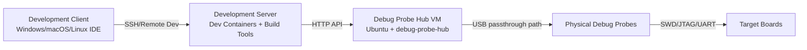
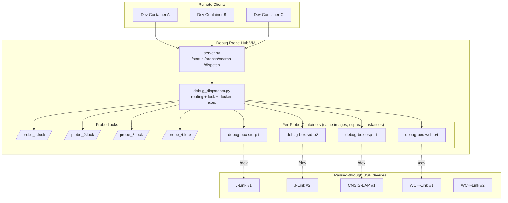

# Architecture

## Role-Based Topology

## Multi-Container and Multi-Probe Runtime

## Why per-probe containers

This project uses per-probe containers to avoid tool concurrency issues:

- Still one image per toolchain, but multiple containers (one per `probe_id`).
- Prevents "cleanup kills other sessions" and helps with commercial tools that can't run concurrently in a shared environment.
- Locking remains probe-specific (`/var/lock/probe_{id}.lock`).
- For `debug` and `print`, a background lock monitor keeps the probe lock while session process is alive, preventing accidental same-probe replacement.

## Mapping rules

- Target selects container via `targets.<target>.container` in `config.yml`.
- Probe compatibility is checked by `targets.<target>.compatible_probes`.
- Actual command is selected by `targets.<target>.commands.<interface>.<mode>`.

## Source references

- Container runtime and USB mount: `generate_docker_compose_probes.py` (generates `docker-compose.probes.yml`)
- Locking and dispatch flow: `debug_dispatcher.py`
- Configuration schema and target/container resolution: `config_loader.py`, `config.yml`
