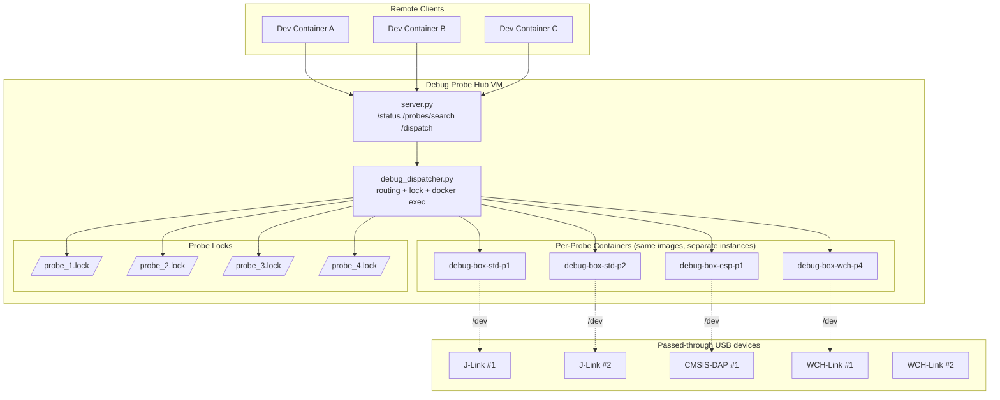

# Architecture
## Multi-Container and Multi-Probe Runtime

## Why per-probe containers

This project uses per-probe containers to avoid tool concurrency issues:

- Still one image per toolchain, but multiple containers (one per `probe_id`).
- Prevents "cleanup kills other sessions" and helps with commercial tools that can't run concurrently in a shared environment.
- Locking remains probe-specific (`/var/lock/probe_{id}.lock`).
- For `debug` and `print`, a background lock monitor keeps the probe lock while session process is alive, preventing accidental same-probe replacement.

## Architecture decisions

### Decision A: One probe = one container + one dedicated IP (rejected)

Question:
- "Why not assign each probe to a separate container with its own IP, and let clients switch by IP?"

Reasons it was rejected:
- Client burden becomes high: each project/tool profile must manage endpoint/IP switching logic.
- Operational burden grows with probe count: IP management, service discovery, and per-endpoint health checks increase.
- Isolation benefit is limited in this system: containers use `privileged: true` and `/dev:/dev`, so USB visibility is shared at device-node level.
- Concurrency/control problems are already handled by probe-level routing + lock files, without forcing clients to manage many endpoints.

### Decision B: One probe = one Mini PC/Raspberry Pi + one IP (rejected)

Question:
- "Why not physically split probes across multiple Mini PCs/Raspberry Pis and switch by host IP?"

Reasons it was rejected:
- Hardware and maintenance cost scale linearly (hosts, power, storage, OS updates, monitoring).
- Failure surface increases: more nodes mean more network and lifecycle drift issues.
- Capacity becomes fragmented (idle probes on one host cannot be flexibly reused as easily).
- For this use case, centralizing probes in one Hub VM with per-probe container instances gives enough operational separation at much lower cost.

## Mapping rules

- Target selects container via `targets.<target>.container` in `config.yml`.
- Probe compatibility is checked by `targets.<target>.compatible_probes`.
- Actual command is selected by `targets.<target>.commands.<interface>.<mode>`.

## Source references

- Container runtime and USB mount: `generate_docker_compose_probes.py` (generates `docker-compose.probes.yml`)
- Locking and dispatch flow: `debug_dispatcher.py`
- Configuration schema and target/container resolution: `config_loader.py`, `config.yml`
